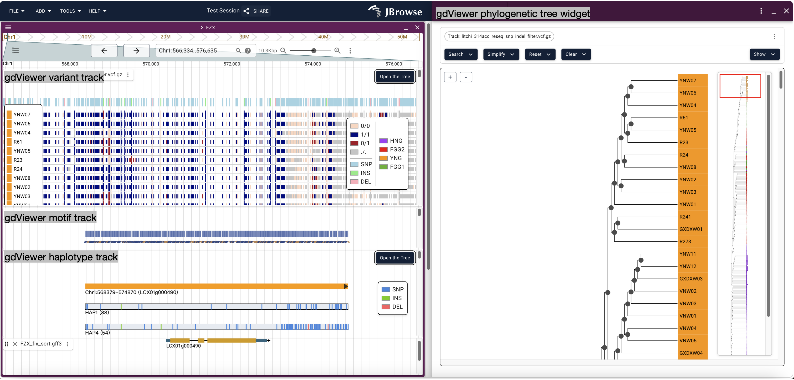
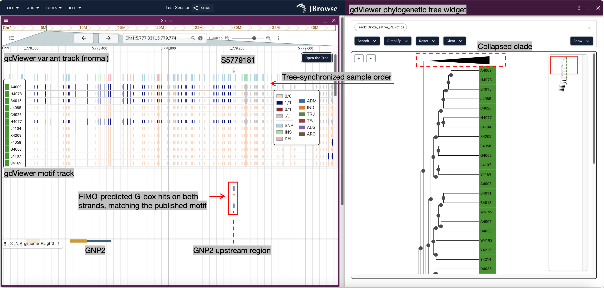
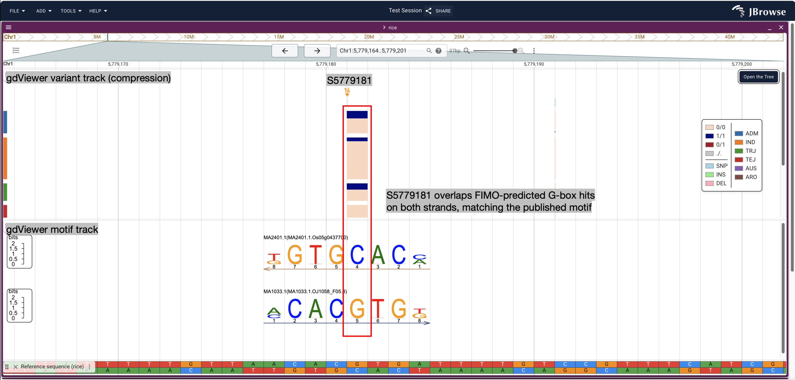
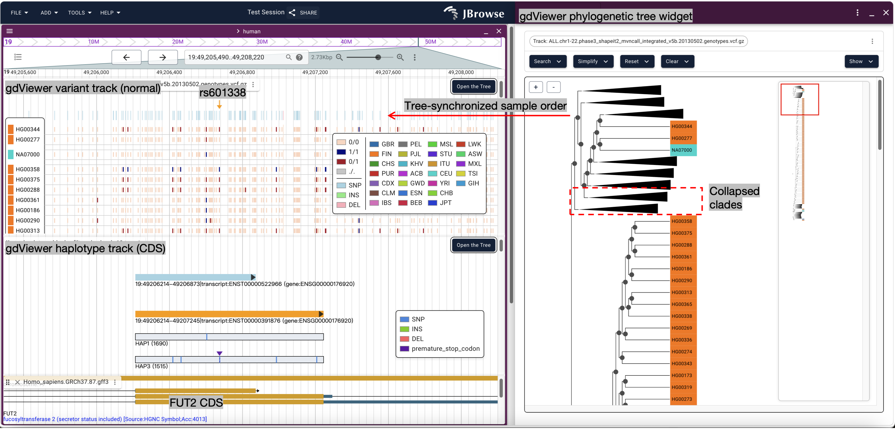
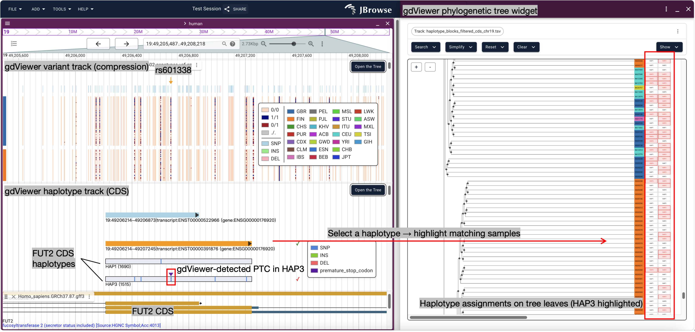

## Development Status

> `gdViewer` is currently under active development and is planned for submission to the JBrowse 2 Plugin Store and publication on npm in the near future. The accompanying cookbook will also be updated with installation instructions, usage examples, and detailed feature descriptions.
>
> The latest development code is available in the [`dev`](../../tree/dev) branch. The `main` branch is not yet intended for general use.

## Overview

gdViewer is a [JBrowse 2](https://jbrowse.org/jb2/) plugin designed for interactive visualization and exploration of genomic diversity.

While conventional workflows often require separate tools to examine variants, motif predictions, haplotype information and phylogenetic tree, gdViewer integrates these data types into a unified browser interface and enhances the exploration of variant patterns across samples.

## Key Features

| Feature | Main functions |
|---|---|
| **Variant Visualization** | Displays variants across samples, including variant types, overall distribution, and detailed information for individual variants. |
| **Motif Visualization** | Displays motif predictions and detailed motif information, with linkage to Variant Visualization for identifying variant–motif overlaps. |
| **Haplotype Visualization** | Displays haplotype groups, identifies potential premature termination codons (PTCs), and supports inspection and sequence copying of haplotypes. |
| **Phylogenetic Tree Integration** | Supports tree operations such as collapsing and pruning, synchronizes sample order with the variant view, and links haplotypes with phylogenetic relationships. |

## Biological Case Studies

### Case Study 1: A Functional SNP within a Regulatory Motif

**Background**

S5779181 is a functional G-to-A SNP located in the upstream regulatory region of *GNP2*, a gene associated with grain number per panicle in rice. The SNP occurs within a G-box motif recognized by the bZIP transcription factor GNP5. The G allele is associated with stronger GNP5 binding, higher *GNP2* expression, and increased grain number per panicle.

**What gdViewer shows**

- **Variant–motif integration (overview):** gdViewer displays genomic variants alongside motif predictions and gene annotation, allowing users to examine candidate regulatory variants within their genomic context. Sample order is also synchronized with the phylogenetic tree.

- **Variant–motif integration (zoomed view):** a zoomed-in view reveals individual motif logos and their overlap with S5779181, allowing direct inspection of the variant position within the predicted G-box. Here, S5779181 overlaps FIMO-predicted G-box hits on both strands in the *GNP2* upstream region, matching the published motif.

**Reference:**  
Hu et al. *Natural variation of GNP2 enhances grain number to benefit rice yield.* Nature Communications 16, 8848 (2025).

### Case Study 2: SNP Introducing a Premature Termination Codon

**Background**

rs601338 is a well-characterized G-to-A nonsense variant in *FUT2*. It introduces a premature termination codon (PTC), resulting in a non-functional FUT2 allele associated with the non-secretor phenotype. Homozygosity for this allele has also been associated with resistance to symptomatic norovirus infection.

**What gdViewer shows**

- **Variant–tree synchronization:** the gdViewer variant track allows detailed inspection of individual genotypes, and sample organization remains synchronized with the phylogenetic tree.

- **Haplotype–tree synchronization:** gdViewer haplotype track displays haplotype assignments on tree leaves and allows a selected haplotype to highlight matching samples in the tree. In this example, HAP3 is highlighted because rs601338 introduces a PTC in the haplotype sequence, which is detected by gdViewer.

**References**

Kelly et al. *Sequence and expression of a candidate for the human Secretor blood group alpha(1,2)fucosyltransferase gene (FUT2).* Journal of Biological Chemistry (1995).

Thorven et al. *A homozygous nonsense mutation (428G→A) in the human secretor (FUT2) gene provides resistance to symptomatic norovirus (GGII) infections.* Journal of Virology (2005).

## Supported Data Types

gdViewer currently supports the following types of genomic information:

| Data type | Input / Preparation |
|---|---|
| Variants | VCF |
| Phylogenetic tree | Newick |
| Motif predictions | gdViewer motif format — generated using [motif-predictor-for-gdViewer](https://github.com/biobardis/motif-predictor-for-gdViewer) |
| Haplotype information | gdViewer haplotype format — generated using [hap-extractor-for-gdViewer](https://github.com/biobardis/hap-extractor-for-gdViewer) |
